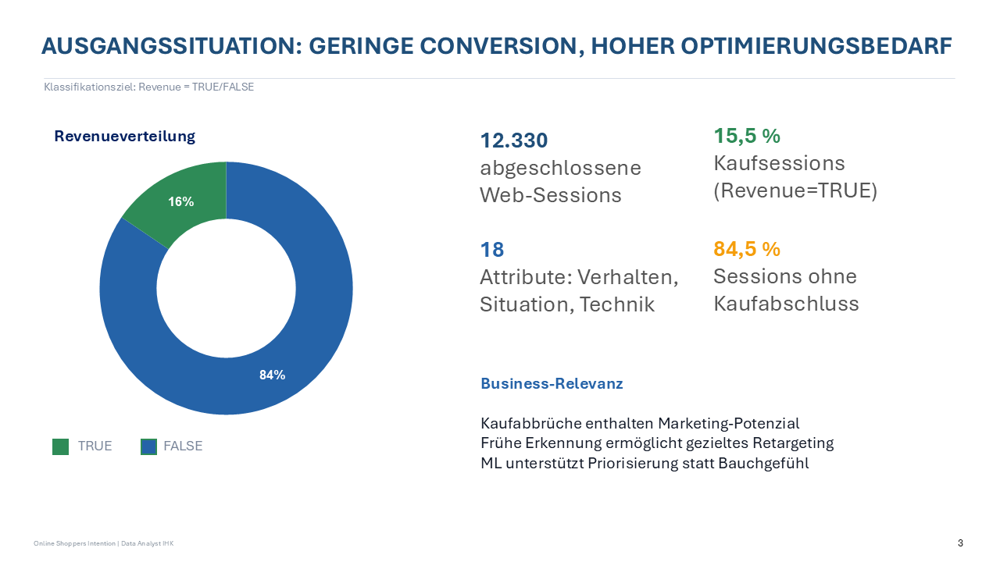
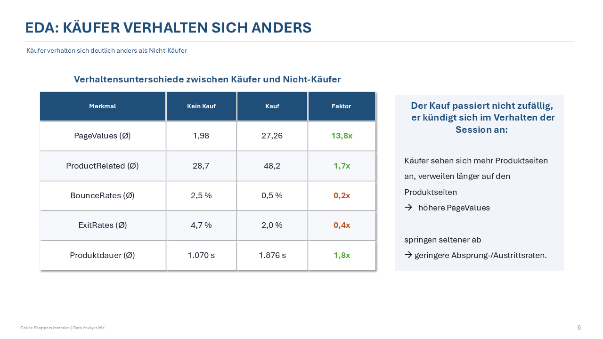
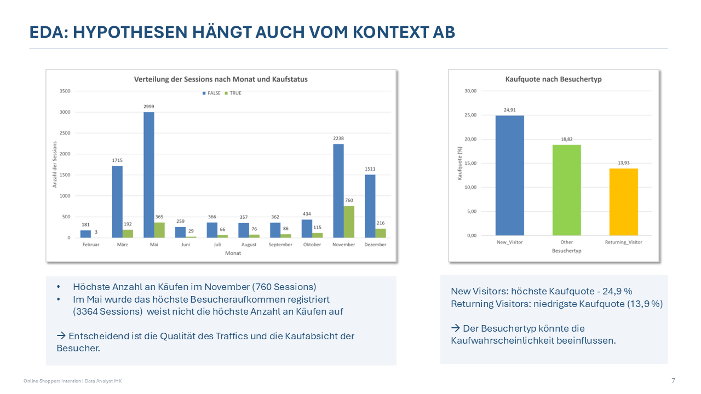
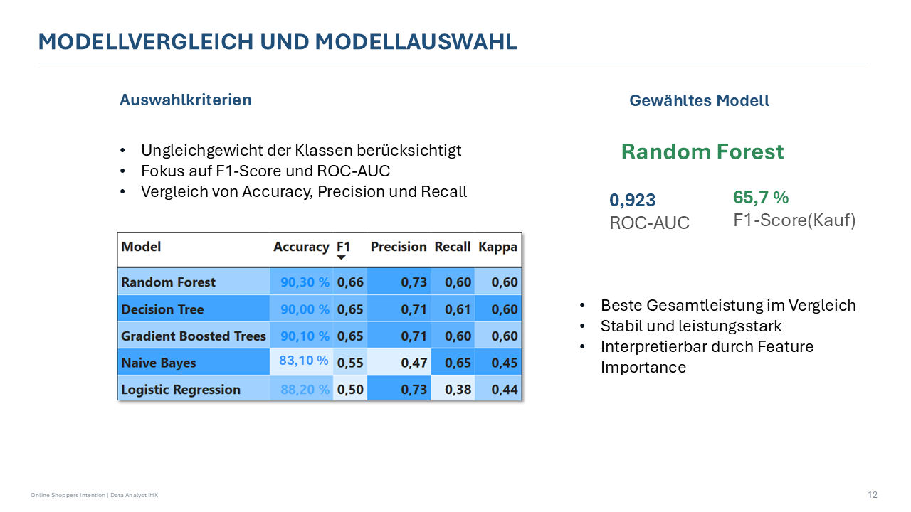
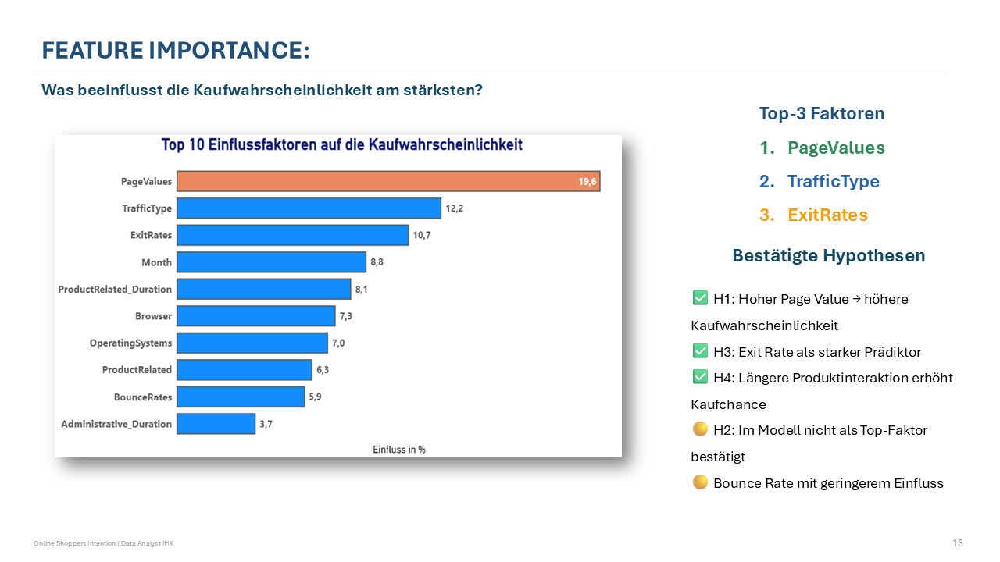
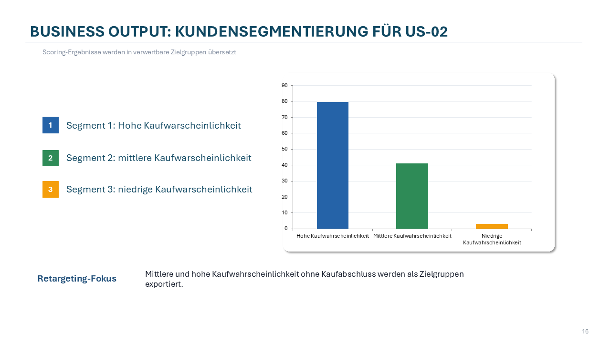
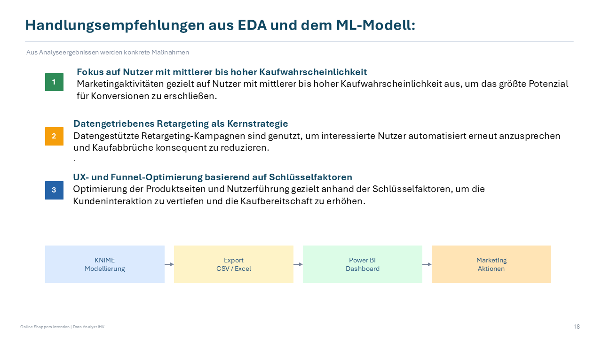
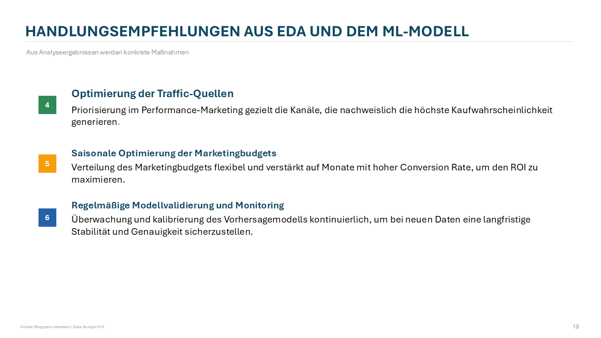

# 🛒 Online Shoppers Purchase Intention Prediction

## Projektübersicht

Dieses Projekt untersucht das Kaufverhalten von Besuchern eines E-Commerce-Webshops und entwickelt ein Machine-Learning-Modell zur Vorhersage der Kaufabsicht.

Ziel war es, potenzielle Käufer frühzeitig zu identifizieren, Kunden nach Kaufwahrscheinlichkeit zu segmentieren und datenbasierte Handlungsempfehlungen für Marketing- und Retargeting-Maßnahmen abzuleiten.

Das Projekt wurde im Rahmen einer IHK-Projektarbeit durchgeführt und kombiniert Datenanalyse, Machine Learning, KNIME und Power BI.

---

## Geschäftsproblem

Im E-Commerce verlassen viele Besucher einen Online-Shop ohne Kaufabschluss. Dadurch entstehen hohe Marketingkosten und ungenutzte Umsatzpotenziale.

Die zentrale Fragestellung lautete:

**Kann anhand des Nutzerverhaltens vorhergesagt werden, ob ein Besucher einen Kauf tätigen wird?**

Die Ergebnisse sollen Unternehmen dabei unterstützen:

* Kaufwahrscheinlichkeiten vorherzusagen
* Marketingbudgets effizienter einzusetzen
* Retargeting-Kampagnen gezielt auszuspielen
* Conversion Rates zu erhöhen
* Kunden besser zu segmentieren

---

## Datengrundlage

Verwendet wurde der Datensatz:

```text
online_shoppers_intention.csv
```

Der Datensatz enthält Informationen zu:

* Besucherverhalten
* Sitzungsdauer
* Seitenaufrufen
* Traffic-Quellen
* Gerätetypen
* Besuchertypen
* Monatsinformationen
* Kaufabschluss (Revenue)

Insgesamt umfasst der Datensatz über 12.000 Website-Sessions.

---

## Projektstruktur

```text
online-shoppers-purchase-intention-ml
│
├── dashboard
│   └── online_shoppers_dashboard.pbix
│
├── data
│   └── online_shoppers_intention.csv
│
├── images
│   ├── business_problem.png
│   ├── eda_conversion.png
│   ├── behavior_analysis.png
│   ├── model_comparison.png
│   ├── feature_importance.png
│   ├── customer_segmentation.png
│   ├── business_recommendations_1.png
│   └── business_recommendations_2.png
│
├── knime
│   └── online_shoppers_ml_workflow.knwf
│
├── presentation
│   └── online_shoppers_ml_presentation.pdf
│
├── reports
│   ├── machine_learning_canvas.pdf
│   └── project_documentation.pdf
│
├── .gitignore
└── README.md
```

---

## Verwendete Technologien

* KNIME Analytics Platform
* Power BI
* Machine Learning
* Random Forest
* Data Mining
* Predictive Analytics
* Business Intelligence
* Git
* GitHub

---

## Projekt ausführen

Zur Reproduktion der Analyse werden folgende Werkzeuge benötigt:

* KNIME Analytics Platform
* Power BI Desktop

Der KNIME-Workflow befindet sich im Ordner:

```text
knime/
```

Das Power-BI-Dashboard befindet sich im Ordner:

```text
dashboard/
```

---

# Business Problem

Analyse der Ausgangssituation und des Optimierungspotenzials im Online-Handel.



---

# Explorative Datenanalyse

## Käufer verhalten sich anders

Vergleich wichtiger Verhaltensmerkmale zwischen Käufern und Nicht-Käufern.



---

## Conversion Analyse

Analyse der Conversion Rate nach Besuchertypen und saisonalen Einflüssen.



---

# Machine Learning

## Modellvergleich

Vergleich verschiedener Machine-Learning-Modelle zur Vorhersage der Kaufwahrscheinlichkeit.



---

## Feature Importance

Identifikation der wichtigsten Einflussfaktoren auf die Kaufentscheidung.



---

# Kundensegmentierung

Besucher wurden anhand ihrer Kaufwahrscheinlichkeit segmentiert, um gezielte Marketingmaßnahmen zu ermöglichen.



---

# Handlungsempfehlungen

## Marketing- und Retargeting-Maßnahmen

Empfehlungen zur Verbesserung der Conversion Rate und zur effizienteren Nutzung von Marketingbudgets.



---

## Operative Umsetzung

Empfehlungen zur kontinuierlichen Optimierung von Kampagnen und Kundenansprache.



---

# Modellergebnisse

Das finale Random-Forest-Modell erzielte:

* Accuracy: 90,3 %
* F1-Score: 65,7 %
* ROC-AUC: 92,3 %

Die Ergebnisse zeigen eine hohe Fähigkeit zur Identifikation potenzieller Käufer und liefern eine belastbare Grundlage für datengetriebene Marketingentscheidungen.

---

# Präsentation

Die vollständige Projektpräsentation befindet sich im Ordner:

```text
presentation/
```

---

# Autorin

**Nataliia Melnytska**

Data Analytics Portfolio Projekt

Machine Learning | KNIME | Power BI | Predictive Analytics | Data Analysis